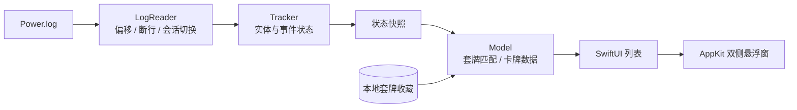

# 炉边记牌器 · Lubian Tracker

**用 Swift 构建的 macOS 炉石传说记牌器：从游戏日志恢复对局，在游戏两侧呈现卡牌信息。**

macOS 13+ · Swift / SwiftUI / AppKit · Apple Silicon & Intel · MIT

[使用指南](docs/USAGE.md) · [架构与设计](docs/ARCHITECTURE.md) · [测试与验证](docs/TESTING.md) · [版本记录](CHANGELOG.md)

## 为什么做这个项目

打牌时需要知道牌库还剩什么、对手已经打过什么，以及下一次疲劳的伤害。炉边把这些信息放在游戏两侧，并将每次对局中可观察到的信息保存在本地状态里。

项目从基础记牌逐步扩展到日志恢复、浮窗交互和多套牌匹配。当前为 **0.6 测试版**，重点是把真实游戏日志转化为可解释、可测试的状态；尚不是覆盖全部卡牌机制的成熟替代品。

## 可以做什么

| 功能 | 当前行为 |
| --- | --- |
| 实时记牌 | 跟随最新 Power.log，更新我方牌库/手牌数量与对手公开出牌 |
| 双侧悬浮窗 | 跟随游戏窗口、调整尺寸/透明度、分别折叠、切换点击穿透 |
| 卡牌预览 | 滚动列表，悬停或点击查看中文效果与在线卡图 |
| 套牌收藏 | 导入套牌代码、命名、去重、保留不同构筑、迁移旧版数据 |
| 自动匹配 | 根据原始卡牌证据筛选已保存套牌；候选不唯一时继续等待 |
| 收藏收录 | 开启后，在炉石前台复制套牌即可收录，不必切回来粘贴 |
| 已知牌库顶 | 跟踪探底揭示的卡牌；抽走、洗牌或新对局后清除提示 |
| 疲劳 | 显示双方已记录的疲劳次数及下一次伤害 |

**边界：**不能保证进入收藏就自动读取所有套牌；Decks.log 收录通道尚未通过真实收藏日志验证。牌库顶目前只覆盖探底路径。复杂变形、交换、生成与其他置顶效果可能影响统计，不支持酒馆战棋。详见[限制与路线图](docs/ROADMAP.md)。

## 快速开始

需要安装 Xcode Command Line Tools。克隆仓库后，在项目目录运行：

```sh
zsh test.command
zsh build.command
```

构建结果位于 `dist/炉边记牌器.app`，可分享的压缩包位于 `dist/炉边记牌器-Mac.zip`。应用同时包含 arm64 与 x86_64，不需要 Python、Node 或额外运行环境。

首次使用：

1. 打开应用，点击「开启游戏日志」，完全退出并重启炉石。
2. 更新中文卡牌库，确认连接到炉石 `Logs` 文件夹。
3. 导入套牌，或开启「收藏自动收录」，在游戏收藏里复制每副套牌一次。
4. 开启「开局自动识别」，进入对局；需要滚动和预览时关闭「点击穿透」。

当前构建仅有本地临时签名，尚未使用 Developer ID 签名和 Apple 公证。安装、日志配置和故障排查见[使用指南](docs/USAGE.md)。

## 实现中值得关注的部分

### 持续增长的日志，不是一次性文件

读取器记录文件标识、字节偏移和未完成行，分块读取，只解析完整行。切换会话、文件截断或替换时重建状态，避免把上一局残留当成当前对局。读取在串行后台队列完成，主线程接收状态快照。

### 卡牌身份可能晚于事件到达

日志中的实体先出现，卡牌 ID 可能在后续 SHOW_ENTITY 中才揭示。解析器保留实体与出牌事件的关联，补齐晚到的身份；同时区分原始卡牌与生成牌，减少对原套牌剩余数量的错误扣减。

### 不确定时保留不确定性

套牌匹配不使用“最像的一副”强行选中，而是用原始卡牌的多重集合约束筛选候选。两副构筑都满足证据时等待更多信息；没有匹配时退回已知卡牌。牌库顶同样需要明确揭示证据，不能由普通区域位置推断。



阅读路径：[LogReader.swift](Sources/LogReader.swift) → [Core.swift](Sources/Core.swift) → [App.swift](Sources/App.swift) → [Overlay.swift](Sources/Overlay.swift)。更详细的取舍见[架构说明](docs/ARCHITECTURE.md)。

## 如何验证

`test.command` 直接编译并运行不依赖游戏、网络或卡牌下载的合成事件测试，覆盖：

- 断行、小块读取、会话轮换、截断和重复日志源；
- 抽牌、换牌、生成牌、延迟身份、原始/核心卡牌版本归一化；
- 套牌代码校验、备选牌、收藏持久化、候选歧义和去重；
- 探底牌库顶的揭示与失效，以及悬浮窗尺寸和多显示器坐标。

仓库还包含本地日志回放入口。真实对局日志不随仓库分发，也不会上传到 CI。测试的覆盖边界、回放方法和验证记录见[测试说明](docs/TESTING.md)。GitHub Actions 配置在每次推送和 PR 时运行测试、构建并验证应用签名；执行结果以仓库 Actions 页面为准。

## 项目结构

```text
Sources/
  Core.swift         实体状态、事件解析、套牌代码、收藏与匹配、布局计算
  LogReader.swift    增量读取与日志生命周期
  App.swift          应用入口、状态协调、存储与主界面
  Overlay.swift      双侧 NSPanel 与卡牌预览
  Tavern.swift       旅店主题、套牌收藏控件、牌库顶组件
  Tests.swift        无游戏依赖的回归测试
  ReplayTests.swift  用户提供日志的本地回放检查
docs/                使用、架构、验证与路线图
```

## 数据、贡献与许可

游戏日志和套牌保存在本机；中文卡牌数据与卡图来自 HearthstoneJSON。当前没有账号服务、遥测或日志上传服务。自动收录只在显式开启后处理炉石前台的新复制内容。完整数据边界见[隐私说明](docs/PRIVACY.md)。

欢迎以可复现的事件片段报告问题；请先去除昵称、战网标识和本机路径。提交解析修改时优先补充能复现行为的合成测试，见 [CONTRIBUTING.md](CONTRIBUTING.md)。

项目采用 AI 辅助开发，设计决策、验证记录与未完成项以仓库代码和文档为准。

源码遵循 [MIT License](LICENSE)。本项目不隶属于 Blizzard；Hearthstone 商标、卡图和第三方数据不属于本项目的 MIT 授权范围。日志行为参考 [HearthSim/HSTracker](https://github.com/HearthSim/HSTracker)，本项目未集成其 HearthMirror 组件。
